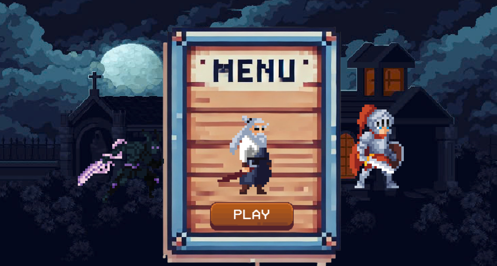
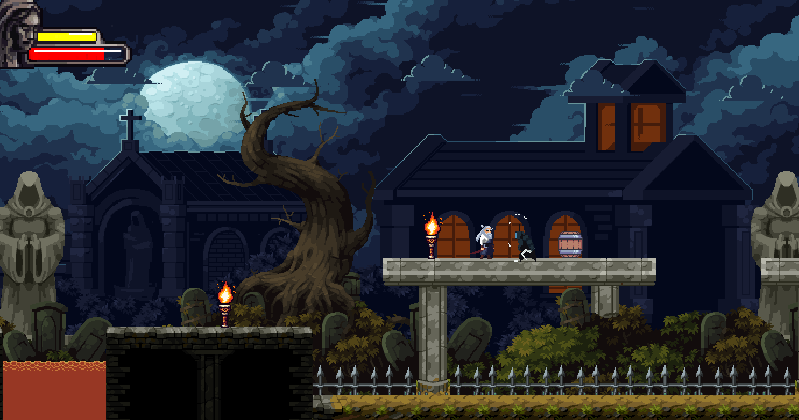

# 🎮 Legend’s Destiny

Trong thế giới hậu tận thế nơi hòa hợp giữa công nghệ và phép thuật từng mang lại sự phồn vinh giờ đây chỉ còn lại những thành phố hoang. Thành Man - trung tâm của mọi sự bí ẩn được bao phủ bởi một màn sương đen kỳ lạ đầy rẫy những quái vật tàn bạo. Người ta đồn rằng trong lòng tháp có một Hắc Hồn Cổ Tháp nơi giữ những sức mạnh nguyên thủy có thể hồi sinh và hủy diệt cả thế giới. Ba con người với số phận khác nhau đã tình cờ gặp gỡ hợp tác trong quá trình tiến vào cổ tháp mỗi người mang lý do và khát vọng riêng. Có người muốn tìm hiểu về sự xuất hiện của quái vật, người thì muốn tìm phần thưởng lớn, kẻ thì muốn được vinh danh thiên hạ. Câu trả lời chỉ hiện ra khi ai đó sống sót qua các cửa ải đầy chông gai và thử thách.

---

## 🚀 Tính năng nổi bật
- Gameplay đơn giản nhưng cuốn hút
- Năm màn chơi với độ khó tăng dần
- Hệ thống quái đa dạng

---

## 📸 Hình ảnh minh họa
  


---

## 🕹️ Cách chơi
1. Cài đặt game (hướng dẫn ở phần dưới).
2. Mở game và nhấn **Enter**.
3. Lựa chọn nhân vật.
4. Điều khiển nhân vật:
   - ASDW: di chuyển
   - Space: lướt
   - J: đánh
   - Esc: tạm dừng
5. Hoàn thành màn chơi bằng cách tiêu diệt hết quái để mở khóa level tiếp theo.

---

## ⚙️ Cài đặt

### Yêu cầu hệ thống
- Đảm bảo rằng bạn đã cài đặt một IDE hỗ trợ Java, ví dụ như **IntelliJ IDEA** hoặc **Eclipse**.  
- Khuyến nghị: sử dụng IntelliJ IDEA để dễ dàng phát triển và chạy ứng dụng.

### Cách cài
```bash
# Clone repo
git clone https://github.com/nxhoang09/oop_game_12.git

Chạy game

Trong thư mục src -> main, tìm và mở file MainClass.java.
Đây là file chứa phương thức main() để khởi động game.